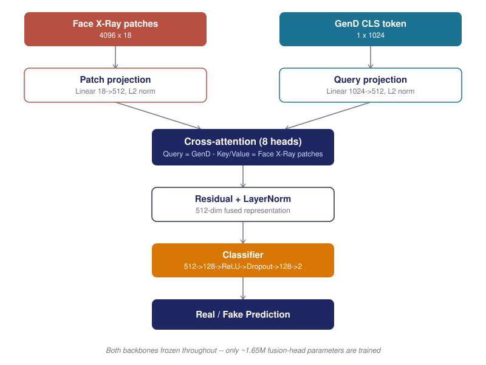

# Cross-Attention Fusion of Blend-Boundary and Semantic Detectors for Deepfakes

> Investigates whether fusing a spatial blend-boundary detector (Face X-Ray) with a semantic foundation-model detector (GenD, DINOv3-based) via a trainable cross-attention mechanism improves deepfake detection beyond either model alone -- with both pretrained backbones kept fully frozen.

**Headline result:** the fusion model beat GenD alone in **5/5 independent training runs** on FaceForensics++ (97.241% +/- 0.040% vs. 96.648% AUC), and the same margin held up on an **independent cross-dataset benchmark** (Celeb-DF v2, 92.835% vs. 92.275% video-level AUC) with no retraining -- evidence the improvement generalizes rather than being an artifact of one dataset.

---

## Table of Contents

- [Overview](#overview)
- [Architecture](#architecture)
- [Key Technical Challenges and Fixes](#key-technical-challenges-and-fixes)
- [Results](#results)
- [Repository Structure](#repository-structure)
- [Setup and Installation](#setup-and-installation)
- [Usage](#usage)
- [Methodology](#methodology)
- [Key Findings](#key-findings)
- [Limitations and Future Work](#limitations-and-future-work)

---

## Overview

Existing deepfake detectors tend to specialise in one of two directions: spatial-artifact detectors (e.g. Face X-Ray) that find the blend boundary left by face-swap manipulation, or semantic foundation-model detectors (e.g. GenD) that form a holistic judgement from a large pretrained vision transformer. This project fuses both, and validates the result both in-distribution and cross-dataset.

**Aim:** to investigate whether fusing Face X-Ray with GenD via a trainable cross-attention mechanism, with both pretrained backbones kept frozen, improves deepfake detection accuracy beyond either model alone.

---

## Architecture

Both backbones (HRNet-W18 for Face X-Ray, DINOv3 ViT-L for GenD) are kept fully frozen throughout -- only the fusion head (~1.65M parameters) is trained, isolating the fusion mechanism contribution from any backbone fine-tuning effect.

---

## Key Technical Challenges and Fixes

Two significant preprocessing bugs were found and fixed through systematic diagnostic testing before any architectural conclusions were drawn.

| Bug | Root cause | Fix | Impact |
|---|---|---|---|
| Face X-Ray backbone never loading | A checkpoint key-prefix mismatch silently discarded ~1954 of ~1958 pretrained weight tensors on load | Removed the erroneous prefix-stripping step | Standalone AUC: 52.1% to 87% |
| Missing face-crop preprocessing | Both models were receiving full, uncropped video frames instead of tightly-cropped faces | Added a face-detection + crop step (1.3x margin) before each model own preprocessing | GenD standalone AUC: 78.5% to 96.1% (frame-level) |

---

## Results

### Final validated comparison (FaceForensics++, in-distribution)

| Configuration | Mechanism | AUC |
|---|---|---|
| Face X-Ray alone | real mask + classifier pipeline | ~87% |
| GenD alone | real trained classifier, exact-match val set | 96.648% |
| Fusion - gated cross-attention | trainable GenD-only fallback | 97.074% |
| Fusion - gated, real GenD fallback | frozen real classifier, gate bias -2.0 | 97.025% |
| Fusion - gated, real GenD fallback | frozen real classifier, gate bias 0.0 | 96.944% |
| Fusion - no gate (winning architecture) | always 100% fused branch | 97.221% (single run) |

### Multi-seed robustness validation

| Seed | AUC | Beats GenD alone (96.648%)? |
|---|---|---|
| 0 | 97.241% | Yes |
| 1 | 97.187% | Yes |
| 2 | 97.215% | Yes |
| 3 | 97.256% | Yes |
| 4 | 97.305% | Yes |

**Mean: 97.241% +/- 0.040%** -- 5/5 seeds beat GenD alone.

### Cross-dataset generalization (Celeb-DF v2, official 518-video test split, no retraining)

| Model | Frame-level AUC | Video-level AUC |
|---|---|---|
| Face X-Ray alone | 66.897% | 76.664% |
| GenD alone | 83.482% | 92.275% |
| Fusion (5-seed ensemble) | 84.408% | 92.835% |

The re-measured GenD-alone figure (92.275%) matches GenD own published Celeb-DF v2 result (92.2%, DINO variant) to within 0.08 points.

---

## Repository Structure

### Final pipeline
| File | Purpose |
|---|---|
| fusion_crossattn_gated_v3.py | Fully corrected pipeline, gated architecture, feature caching |
| fusion_no_gate_pure.py | Winning architecture -- no-gate cross-attention fusion |
| fusion_multiseed_validation.py | Trains the winning architecture across 5 seeds |
| evaluate_celebdf.py | Cross-dataset evaluation on Celeb-DF v2 |

### Diagnostics
| File | Purpose |
|---|---|
| inspect_and_verify_gend.py | GenD model structure inspection |
| verify_facexray_real_pipeline.py | A/B tests for loading, normalization, face-cropping |
| verify_gend_facecrop.py | A/B test confirming GenD required face-cropped input |
| compare_gend_vs_fusion_exact_match.py | Exact-match GenD-alone baseline |

### Architecture experiments / ablations
| File | Purpose |
|---|---|
| fusion_crossattn_gated.py | First gated fusion implementation (pre-fix) |
| fusion_crossattn_gated_v2.py | Gated fusion with the Face X-Ray fix applied |
| fusion_experiments_v3.py | Regularization and residual-correction fusion comparison |
| fusion_real_gend_fallback.py | Tests replacing the trained-from-scratch fallback with GenD real classifier |

---

## Setup and Installation

Environment: Python 3.12, PyTorch, see requirements.txt for full dependency list.

Pretrained weights required:
- Face X-Ray: HRNet-W18 checkpoint
- GenD: yermandy/GenD_DINOv3_L (auto-downloaded from Hugging Face)

Datasets: FaceForensics++ (c23), Celeb-DF v2 (official request form required)

---

## Usage
python fusion_crossattn_gated_v3.py --epochs 30
python fusion_multiseed_validation.py
python evaluate_celebdf.py

---

## Methodology

Experimental deep learning research methodology, iterative development across five phases:

1. Data Pipeline -- preprocess deepfake datasets, clean/normalise, split train/val/test.
2. Baseline -- reproduce and validate the original baseline framework.
3. Model Integration -- implement the GenD encoder and Face X-Ray blend-boundary detector; design the cross-attention fusion module.
4. Training and Evaluation -- train in PyTorch; evaluate via AUROC, F1-score, and accuracy; test cross-dataset generalisation.
5. Failure Analysis and Manuscript -- apply Grad-CAM/saliency maps to diagnose failure modes, refine accordingly, write up findings.

---

## Key Findings

1. A strong fallback removes the pressure to fuse. With a genuinely strong fallback branch, the model relied on it almost exclusively and performance regressed toward GenD-alone. With a weaker fallback, the model was forced to genuinely engage with the fused signal and outperformed GenD alone.
2. The simplest design won. Removing the gate entirely beat every gated variant tested, with fewer trainable parameters.
3. Preprocessing bugs explained more of the early performance gap than any architecture choice.
4. The improvement generalizes. The same-sized margin over GenD alone held up on an independent, cross-dataset benchmark with no retraining.

---

## Limitations and Future Work

- Cross-dataset testing is partial -- only Celeb-DF v2 has been tested; DFDC has not yet been run.
- F1-score has not been computed -- evaluation so far uses AUROC and accuracy only.
- No failure/interpretability analysis yet -- Grad-CAM/saliency-map diagnosis has not been started.
- Baseline reproduction (Phase 2) scope needs confirming against the original methodology.
- The FF++ official held-out test split has not been used.
- Full architecture ablation table on the fully-corrected feature pipeline is in progress.
